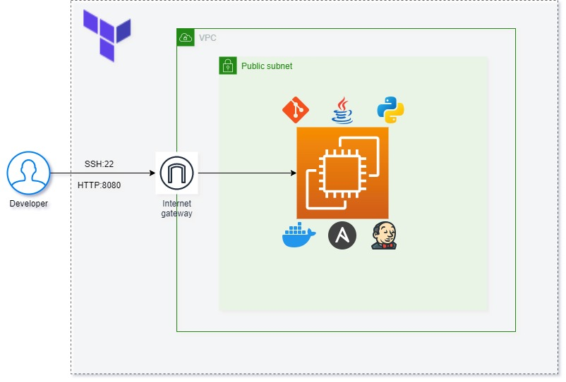
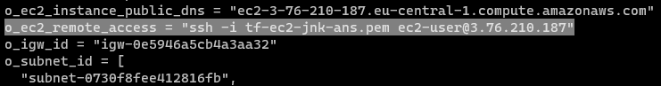
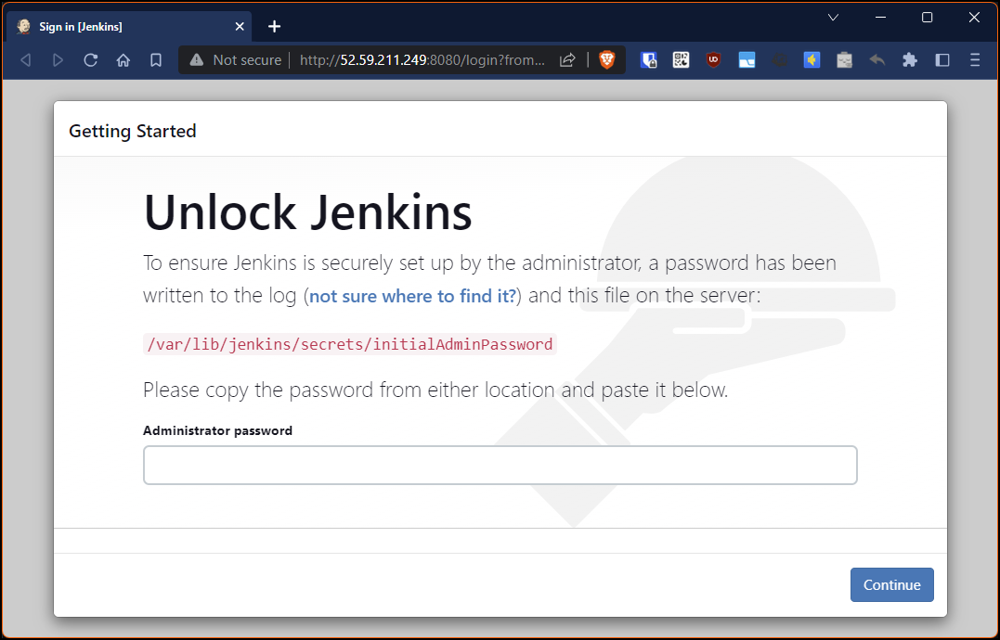
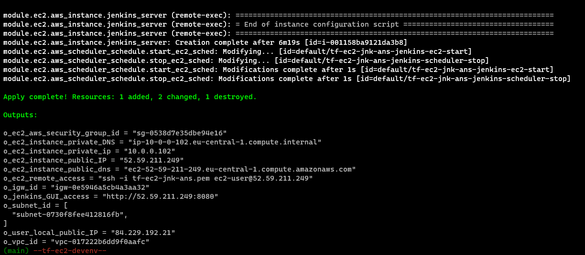
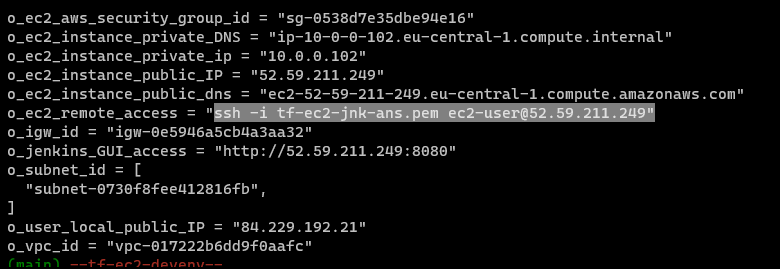
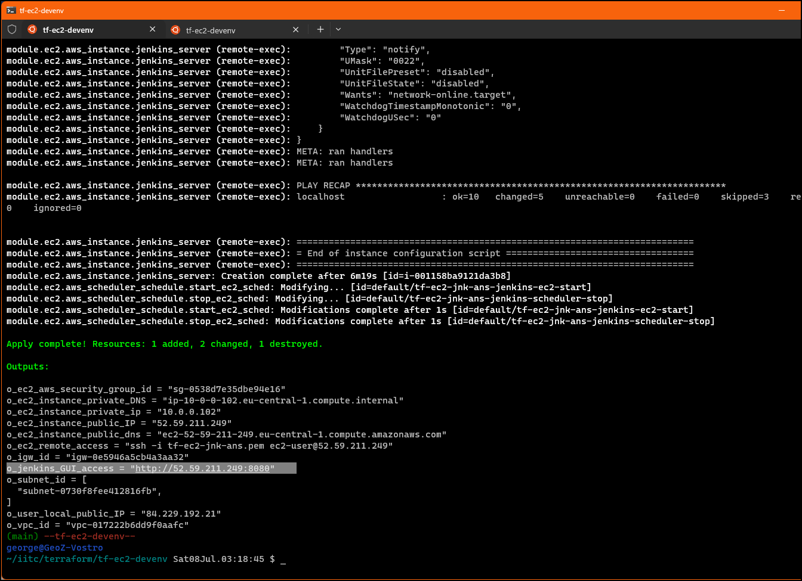
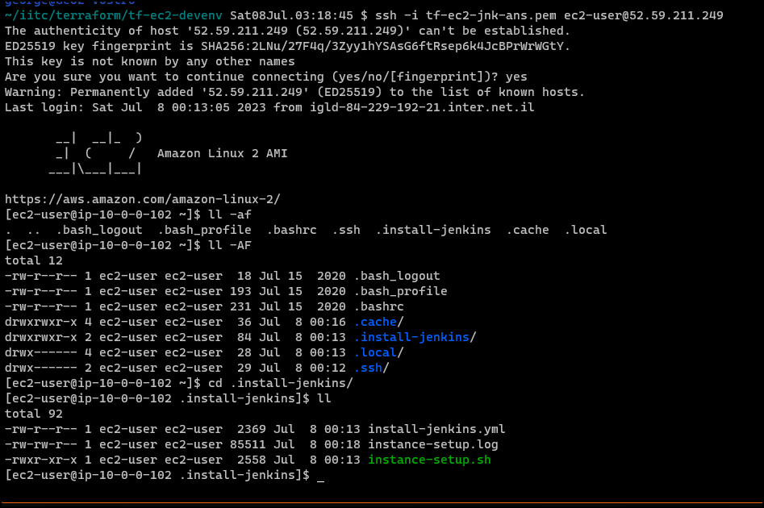

## Project Introduction:

Deploy a simple Public EC2 instance using Terraform.
On creation, the instance will have automatically installed *Git, Java, Python, Docker, Ansible & Jenkins* using a combination of a bash script and ansible.

During deployment, a hidden folder will be created in the instance called *'.install-jenkins'*.
The folder will contain the bash script file *'install-setup.sh'* and a log file with the same name which will store the result of the installation execution (for debugging purposes).

## Architecture diagram of this solution



## Instructions:
- Clone this project in a folder of your choice in a Linux session.

- Customize the project specific parameters in file *'terraform.tfvars'* (defaults to *eu-central-1* region and *eu-central-1a* zone).
  Use this file to customize the project name, the region, availability_zones, VPC CIDR, subnet CIDRs, ssh key file name, email address.

- Environment Variables (optional)
  This is needed if you havent configured a user in AWSCLI with the *'aws configure'* command.
  - AWS_ACCESS_KEY_ID    : your user's Access Key ID
  - AWS_SECRET_ACCESS_KEY: your user's Secret access key.

  Alternatively, the AWS credentials can be added to the *'terraform.tfvars'* file, if preferred.

- On a terminal session, issue the following commands in the project's directory:
  ```shell
  export AWS_ACCESS_KEY_ID=<your_access_key_id>
  export AWS_SECRET_ACCESS_KEY=<your_secret_key>
  
  terraform init
  terraform validate
  terraform plan
  terraform apply
  ```

When finished, the *'terraform apply'* command will produce a list of outputs which includes the IP of the created instance and a command line to be used for ssh connection to the instance. Just copy this command and execute it in your shell to connect to it.
(see screen outputs at bottom of this file)

## Usage of the deployed architecture

+ EC2 instance

Use your terminal to SSH into the EC2 public IP using the generated PEM file in the project root directory.
Use the command line provided as output of the terraform script for SSH connection. 


+ Jenkins

Connect to the Jenkins GUI on the EC2 public IP at port 8080 using HTTP in your browser.
Ctrl-click at the link in the outputs will take you straight to it.


## Pre-requisites

+ AWS account with the relevant permissions to perform the creation functions (admin-like preferred)
+ AWSCLI installed (Amazon Command Line interface)
+ Terraform locally installed

## Outputs

+ Sample screenshot after terraform apply ends


+ Sample screenshot of ssh connection string in output to copy and connect using generated pem file


+ Sample screenshot of link to jenkins GUI generated in output


+ Session opened using connection string.
  
  A hidden directory [.install-jenkins] is created by the installation script, inside of it you can find the ansible yml file, the 
  installation script and the log file at the time of deployment.


Enjoy!
George


