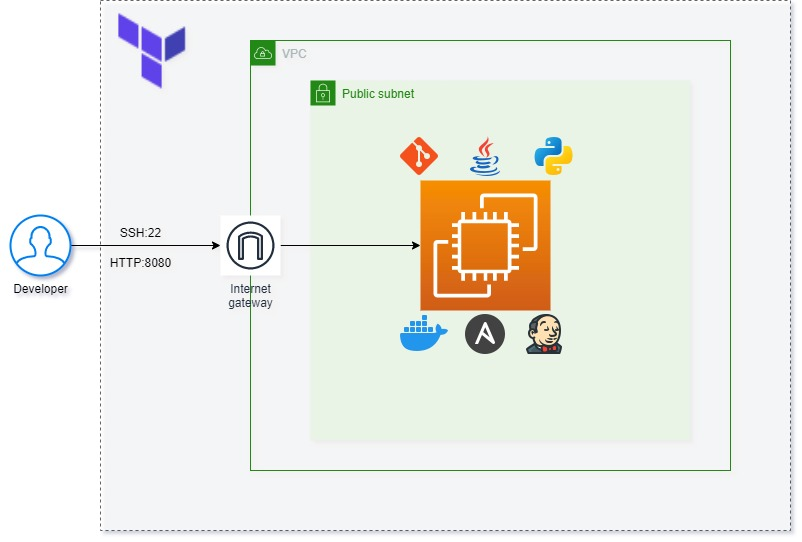
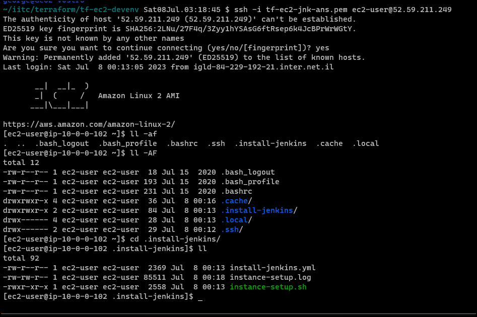

## Project Introduction:

Deploy a simple Public EC2 instance using Terraform.
On creation, the instance will have automatically installed *Git, Java, Python, Docker, Ansible & Jenkins* using a combination of a bash script and ansible.

During deployment, a hidden folder will be created in the instance called *'.install-jenkins'*.
The folder will contain the bash script file *'install-setup.sh'* and a log file with the same name which will store the result of the installation execution (for debugging purposes).

## Architecture diagram of this solution



# Deploys the following resources in AWS account:

- VPC (CIDR configurable in *'terraform.tfvars'* file)
- Public Subnets (according to the number of CIDRs configured in *'terraform.tfvars'* file)
- Security Group with SSH and 8080 (for Jenkins GUI) (for any IP) (TODO: for your current public IP as the only allowed ingress access)
- Internet Gateway
- Route table
- Private key file (with extension PEM), to be used for SSH connection to the Instance
- Amazon-Linux EC2 instance with public IP/public DNS using latest AMI-based Amazon Linux image
- EventBridge schedules that start & stop the instance automatically at 07:00 and 19:00.
- EventBridge rule that triggers an SNS topic on EC2 instance change
- SNS topic that notifies an email address when the instances are started or stopped (automatically or manually)

## Instructions:
- Clone this project in a folder of your choice in a Linux session.
  ```shell
  git clone https://github.com/georgezengin/TF-EC2-Ans-Dkr.git
  ```
  
- Customize the project specific parameters in file *'terraform.tfvars'* (defaults to *eu-central-1* region and *eu-central-1a* zone).
  Use this file to customize the project name, the region, availability_zones, VPC CIDR, subnet CIDRs, ssh key file name, email address.

- Environment Variables (optional)
  This is needed if you havent configured a user in AWSCLI with the *'aws configure'* command.
  - AWS_ACCESS_KEY_ID    : your user's Access Key ID
  - AWS_SECRET_ACCESS_KEY: your user's Secret access key.
  ```shell
  export AWS_ACCESS_KEY_ID=<your_access_key_id>
  export AWS_SECRET_ACCESS_KEY=<your_secret_key>
  ```
  Alternatively, the AWS credentials can be added to the *'terraform.tfvars'* file, if preferred.

- On a terminal session, issue the following commands in the project's directory:
  ```shell  
  terraform init
  terraform validate
  terraform plan
  terraform apply  # (enter yes when prompted to apply changes)
  ```

On completion, the *'terraform apply'* command will produce a list of outputs among those the following:
- Public IP of the created instance
- CLI string to be used for ssh connection to the instance.
  Just copy this command and execute it in your shell to connect to it.
(see screen outputs at bottom of this file)

# When finished - don't forget to delete the deployed resources to avoid unnecessary charges
For that purpose, run the following command on the command line of your deployment terminal (not the EC2 instance shell)
```shell
terraform destroy
```

## Usage of the deployed architecture

+ EC2 instance

Use your terminal to SSH into the EC2 public IP using the generated PEM file in the project root directory.
Use the command line provided as output of the terraform script for SSH connection. 


+ Jenkins

Connect to the Jenkins GUI on the EC2 public IP at port 8080 using HTTP in your browser.
Ctrl-click at the link in the outputs will take you straight to it.


## Pre-requisites

+ AWS account with the relevant permissions to perform the creation functions (admin-like preferred)
+ AWSCLI installed (Amazon Command Line interface)
+ Terraform locally installed

## Outputs

+ Sample screenshot after *terraform apply* ends


+ Sample screenshot of outputs generated

  (includes ssh connection string and Jenkins GUI URL)


+ Session opened using connection string.
  
  A hidden directory [.install-jenkins] is created by the installation script, inside of it you can find the ansible yml file, the 
  installation script and the log file at the time of deployment.



+ Sample of Mail Notification on Instance Start/Stop


Enjoy!
George
